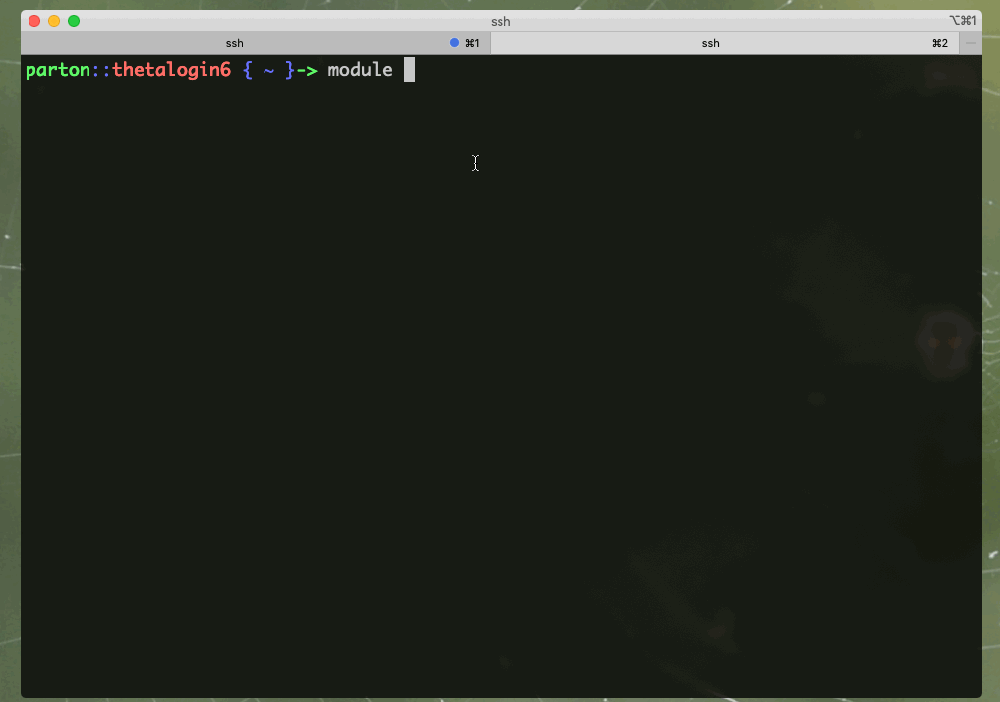

# How to setup your environment

After you login to Theta, by default, you will land in a [BASH](https://www.gnu.org/software/bash/) shell command line interface. 

The term _environment_ refers to the software that is easily accessible to you via the command line. For instance, if I type a command `ls ./` to list the local directory contents, the actual executable `ls` lives somewhere and BASH needs to know where to find it. In order to tell BASH where to find executables, you add paths to a BASH variable called `PATH`. For instance when you login to Theta you can type `echo $PATH` to see all the default places BASH has been told by our system administrators to look for executables. You can type `which ls` to find out where BASH has found the command `ls`. 

# Intro to Modules



Theta uses [Modules](https://modules.readthedocs.io/en/latest/) to control the loading of software environments. When you load a module, BASH environment variables are altered to add or remove software executables and/or libraries from your terminal's search space. This doesn't "install" software or change where the software is located, it simply tells BASH where to find the software so you can use it.

Let's take Python as an example. If I want to run a python script, I need to type `python script_name.py`. However, BASH needs to know where to find the `python` executable. If you have just logged into Theta and type `which python` you might notice BASH finds it here `/usr/bin/python` and running `python --version` tells you that this is Python v2.7.18. We want to use a more modern python for our example so we will run:
```bash
module load conda/2021-09-22
```
This is a python installed in September 2021, so it's up to date. If you run `which python` again, you'll find the Python executable is now something similar to `/lus/theta-fs0/software/datascience/conda/conda/2021-09-22/mconda3/bin/python` and the version is v3.8.10. There are many modules installed on Theta, but we will focus on using this python environment.

It is important to know that when you login to any supercomputer, you land on a _login_ node which typically has standard CPUs on it while the _worker_ nodes will have a different configuration, including the high-speed network. This means software must be compiled carefully to run on the _worker_ node. This may mean that if you compile code for the _worker_ node, you may also not be able to run it on the _login_ node without getting hard to interpret errors. Therefore, if you need to compile software, we recommend doing so on the _worker_ node. You can do this using an _interactive_ job which will be covered in the job submission section.

## Module commands
* `module list`: list currently loaded modules
* `module avail`: list modules available to be loaded
* `module load <module-name>`: load a module
* `module unload <module-name>`: unload a module

# Editors

When you work on a remote system, editing code requires either an editor that runs in your bash terminal or that operates remotely. We'll focus on editing via the bash terminal here.

There are two primary text editors you'll find on supercomputers, [EMACS](https://www.gnu.org/software/emacs/tour/) and [VI](https://www.guru99.com/the-vi-editor.html). They offer similar capabilities with different keyboard interfaces. You can run these editors by typing their command names `emacs` or `vi` plus a filename (new or existing): 
* `vi filename.py`
* `emacs filename.py`

There are many keyboard reference "cheatsheets" online for both editors, just run a search for them:
* [EMACS Cheatsheet](https://www.gnu.org/software/emacs/refcards/pdf/refcard.pdf)
* [VI Cheatsheet](http://www.atmos.albany.edu/daes/atmclasses/atm350/vi_cheat_sheet.pdf).

These two editors are highly configurable and even though they are simply using a text-based interface can process mouse input if configured properly. If you save the following code to `$HOME/.vimrc` it will configure your `vi` editor in reasonable ways. 
```bash
syntax on
set mouse=a
if has("mouse_sgr")
   set ttymouse=sgr
else
   set ttymouse=xterm2
end
set ai
set tabstop=3
set whichwrap+=<,>,h,l,[,]
set expandtab
set shiftwidth=3
set hlsearch
set ignorecase
set smartcase
set incsearch
set ruler
set cursorline
set title
set showmatch
set showbreak=\ \ \
xnoremap p pgvy
set backspace=indent,eol,start

" Uncomment the following to have Vim jump to the last position when
" reopening a file
if has("autocmd")
  au BufReadPost * if line("'\"") > 1 && line("'\"") <= line("$") | exe "normal! g'\"" | endif
endif
```


