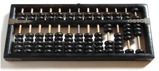
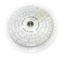

# Evolution of computation
## Counting rods
Counting rods were used in China for calculation. They are typically 3–14 cm (1" to 6") long, made with banboo, placed either horizontally or vertically to represent any integer or rational number.

  
   

## Abacus
An abacus is a simple counting device that has been used for centuries in various cultures around the world. It typically consists of a series of rods or wires, each containing movable beads. The beads are manipulated to represent different numerical values, and the abacus is used for basic arithmetic operations such as addition, subtraction, multiplication, and division. It serves as a visual aid to facilitate calculations and is often employed as a teaching tool for learning mathematical concepts. The design and structure of abacuses may vary, but the fundamental principle remains the same across different versions.

## Slide rule
A slide rule is a hand-operated mechanical calculator consisting of slidable rulers for evaluating mathematical operations such as multiplication, division, exponents, roots, logarithms, and trigonometry. It is one of the simplest analog computers.

## Pascal mechanical calculator
Pascal's calculator (also known as the arithmetic machine or Pascaline) is a mechanical calculator invented by Blaise Pascal in 1642. Pascal was led to develop a calculator by the laborious arithmetical calculations required by his father's work as the supervisor of taxes in Rouen.[2] He designed the machine to add and subtract two numbers directly and to perform multiplication and division through repeated addition or subtraction.

  
   

## Leibnez calculator

The Leibniz calculator, also known as the stepped reckoner, was an early mechanical calculator invented by the German mathematician and philosopher Gottfried Wilhelm Leibniz in the late 17th century. Leibniz designed the calculator with the intention of automating arithmetic calculations, making it easier and more efficient than manual methods.

The Leibniz calculator used a stepped drum mechanism, where cylindrical drums with stepped notches were mounted on a common axis. Each notch on the drum represented a digit, and the rotation of the drums allowed for the manipulation of numerical values. Leibniz incorporated a carry mechanism, enabling the calculator to handle addition and carry-over operations automatically.

  

## Electronic calculator

## ENIAC Computer
ENIAC, which stands for Electronic Numerical Integrator and Computer, was the world's first general-purpose electronic digital computer. It was designed and built during World War II to solve complex numerical calculations for the U.S. Army. The development of ENIAC started in 1943 and was completed in 1945 at the University of Pennsylvania.

**Size and Structure**: ENIAC was massive, occupying a large room with dimensions of about 30 by 50 feet. It consisted of 40 panels and used over 17,000 vacuum tubes.

**Electronic Components**: It was one of the first machines to use electronic components extensively, employing vacuum tubes for computation. Vacuum tubes were used for amplification and switching functions.

**Programming**: ENIAC was programmed using a combination of plugboards and switches. The process of reprogramming the machine was time-consuming and required physical rearrangement of cables and settings.

**Speed and Performance**: ENIAC was significantly faster than previous mechanical computers. It could perform calculations in seconds that would take hours or days with earlier technologies.

  

## Laptops, tablets, phones

  
 

* Macbook Pro M2: 3.6 TFLOPs (fp32)
* iPhone 15: 2.15 TFLOPs (fp32)

## Moore's law
Moore's Law is an observation and prediction made by Gordon Moore, co-founder of Intel, in 1965. The law states that the number of transistors on a microchip, and therefore the computing power of a semiconductor, tends to double approximately every two years, while the cost of manufacturing decreases. In essence, this implies a rapid and exponential increase in the performance of electronic devices over time.

  

## Quantum Computers
Quantum computing is a field of computing that utilizes principles from quantum mechanics, a branch of physics that describes the behavior of matter and energy at the smallest scales. Unlike classical computers, which use bits to represent either a 0 or a 1, quantum computers use quantum bits, or qubits.

  
 
  

## AI testbeds
https://www.alcf.anl.gov/alcf-ai-testbed

The AI Testbed aims to help evaluate the usability and performance of machine learning-based high-performance computing applications running on these accelerators. The goal is to better understand how to integrate with existing and upcoming supercomputers at the facility to accelerate science insights.

We are currently offering allocations on our Groq, Graphcore Bow IPUs, Cerebras CS-2, and SambaNova DataScale systems. 

  
  
 
  
  

## Supercomputers
Supercomputers are designed by connecting massive amount of CPUs and GPUs 

  
 
  Aurora supercomputer

**The need for supercomputers** 
Training large language model is very expensive. There is a need to train language 

  

**History of supercomputers**

  
  

