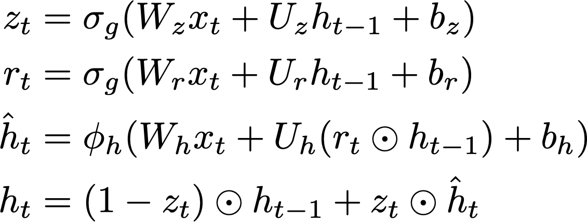
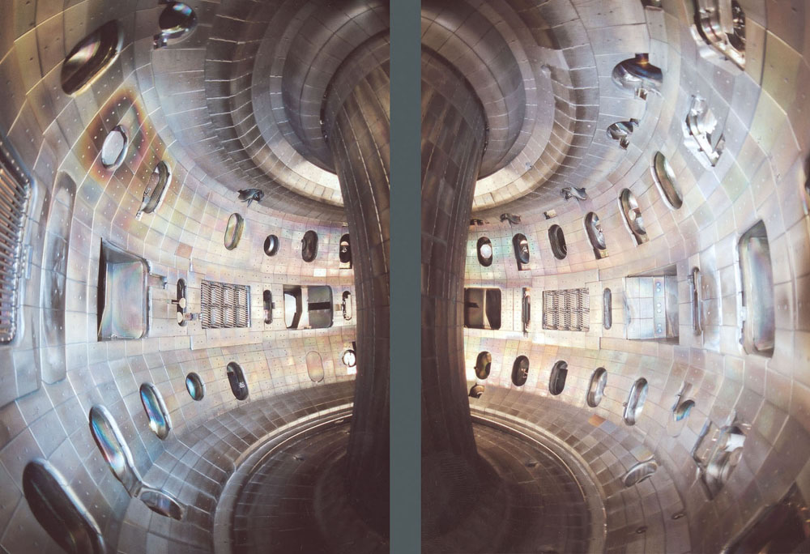

# Time series data

- Classification
- Regression 
- Prediction
- Compression

Applications
- natural language processing
- speech recognition
- traffic forecasting (see Diffusion Convolutional Recurrent Neural Network (DCRNN))

Successors:
- Transformers and their variants (GPT, BERT, BART, Reformer, Longformer, ...)
- Vision transformers

All RNN diagrams from Chirstopher Olah's famous 2015 blog post, [Understanding LSTM Networks](https://colah.github.io/posts/2015-08-Understanding-LSTMs/)

## Vanilla/Simple Recurrent Neural Network (RNN)

## Long short-term memory (LSTM)
Introduced by [Hochreiter and Schmidhuber (1997)](https://direct.mit.edu/neco/article-abstract/9/8/1735/6109/Long-Short-Term-Memory?redirectedFrom=fulltext)

## Gated recurrent unit (GRU)
Introduce by [Cho (2014)](https://arxiv.org/abs/1406.1078), the fully gated version is just an LSTM minus the output gate and has fewer parameters. 

## Example application: predicting anomalies in fusion reactors (tokamaks)
See [Kates-Harbeck (2019)](https://www.nature.com/articles/s41586-019-1116-4) for more details.

