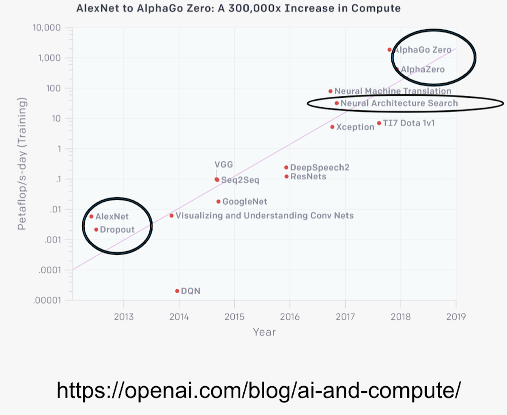
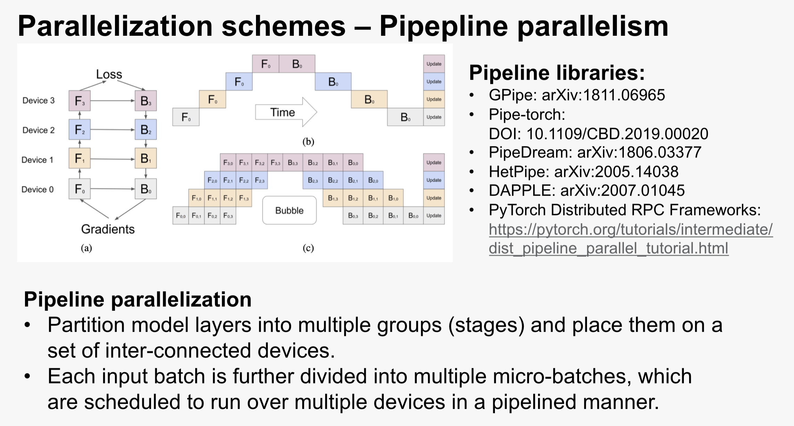

# Distributed trainng


# Distributed training with Horovod
Led by Huihuo Zheng from ALCF (<huihuo.zheng@anl.gov>)

**Goal of this tutorial**
* Understand parallelization 
	- Model parallelism
	- Data parallelism
* Know how to modify your code with Horovod
* Know how to run distributed training on Polaris / ThetaGPU and measuring the scaling efficiency

## Introduction to distributed Deep Learning

The goal for train the model at large scale is to reduce the time-to-solution to reasonable amount. By using training the model in parallel, it reduces the total training time from weeks to minutes.


## Model Parallelism and Data Parallelism

1. **Model parallelism**: in this scheme, disjoint subsets of a neural network are assigned to different devices. Therefore, all the computations associated to the subsets are distributed. Communication happens between devices whenever there is dataflow between two subsets. Model parallelization is suitable when the model is too large to be fitted into a single device (CPU/GPU) because of the memory capacity. However, partitioning the model into different subsets is not an easy task, and there might potentially introduce load imbalance issues limiting the scaling efficiency.  
2. **Data parallelism**: in this scheme, all the workers own a replica of the model. The global batch of data is split into multiple minibatches, and processed by different workers. Each worker computes the corresponding loss and gradients with respect to the data it posseses. Before the updating of the parameters at each epoch, the loss and gradients are averaged among all the workers through a collective operation. This scheme is relatively simple to implement. MPI_Allreduce is the only commu




Our recent presentation about the data parallel training can be found here: https://youtu.be/930yrXjNkgM

## Horovod Data Parallel Framework

Reference: https://horovod.readthedocs.io/en/stable/
1. Sergeev, A., Del Balso, M. (2017) Meet Horovod: Uber’s Open Source Distributed Deep Learning Framework for TensorFlow. Retrieved from https://eng.uber.com/horovod/
2. Sergeev, A. (2017) Horovod - Distributed TensorFlow Made Easy. Retrieved from https://www.slideshare.net/AlexanderSergeev4/horovod-distributed-tensorflow-made-easy

3. Sergeev, A., Del Balso, M. (2018) Horovod: fast and easy distributed deep learning in TensorFlow. Retrieved from arXiv:1802.05799

**8 Steps to modify your code with Horovod**:
  1. Initialize Horovod
  2. Pin GPU to each process
  3. Sharding / partioning the dataset
  4. Scale the learning rate
  5. Set distributed optimizer / gradient tape
  6. Broadcast the model & optimizer parameters to other rank
  7. Checking pointing on rank 0
  8. Average metric across all the workers

## TensorFlow with Horovod
1) **Initialize Horovod**
	```python
	import horovod.tensorflow as hvd 
	hvd.init()
	```
	After this initialization, the rank ID and the number of processes can be refered as ```hvd.rank()``` and ```hvd.size()```. Besides, one can also call ```hvd.local_rank()``` to get the local rank ID within a node. This is useful when we are trying to assign GPUs to each rank. 

2) **Assign GPUs to each rank**
	```python
	# Get the list of GPU
	gpus = tf.config.experimental.list_physical_devices('GPU')
	# Ping GPU to the rank
	tf.config.experimental.set_visible_devices(gpus[hvd.local_rank()], 'GPU')
	```
	In this case, we set one GPU per process: ID=```hvd.local_rank()```

3) **Loading data according to rank ID and ajusting the number of time steps**

	In data parallelism, we distributed the dataset to different workers. It is important to make sure different workers work on different part of the dataset, and they together can cover the entire dataset at each epoch. 

	For TensorFlow, if you are using ```tf.data.Dataset```, you can use the sharding functionality 
	```python
	dataset = dataset.shard(num_shards=hvd.size(), index=hvd.rank())
	```
	where dataset is a ```tf.data.Dataset``` object. 

4) **Scale the learning rate with number of workers**

	Typically, since we use multiple workers, if we keep the local batch size on each rank the same, the global batch size increases by $n$ times ($n$ is the number of workers). The learning rate should increase proportionally (assuming that the learning rate initially is 0.01).
	```python
	opt = tf.train.AdagradOptimizer(0.01*hvd.size())
	```

5) **Wrap tf.GradientTape with Horovod Distributed Gradient Tape**

	```python
	tape = hvd.DistributedGradientTape(tape)
	```
	So that this can also ```tape``` operator will average the weights and gradients among the workers in the back propagating stage. 

6) **Broadcast the model from rank 0**

	This is to make sure that all the workers will have the same starting point.
	```python
	hvd.broadcast_variables(model.variables, root_rank=0)
	hvd.broadcast_variables(opt.variables(), root_rank=0)
	```
	**Note: broadcast should be done AFTER the first gradient step to ensure optimizer initialization.**

7) **Checkpointing on root rank**

	It is important to let only one process to do the checkpointing I/O. 
	```python
	if hvd.rank() == 0: 
		checkpoint.save(checkpoint_dir)
	```

8) **Average the metrics across all the workers**
	```python
	loss = hvd.allreduce(loss, average=True)
	acc = hvd.allreduce(acc, average=True)
	```

Example in: 
* [train_resnet34_hvd.py](train_resnet34_hvd.py)


Examples for other frameworks (PyTorch, Keras, MxNet) can be found [here](https://github.com/horovod/horovod/tree/master/examples). 

## Handson


## Homework
* Modify the 